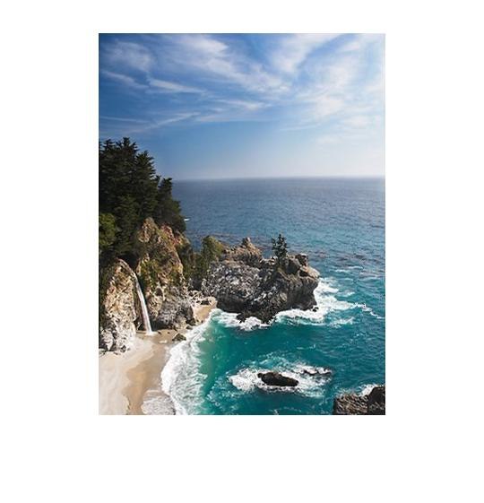
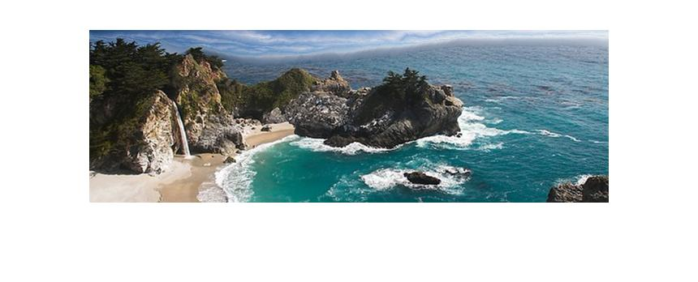
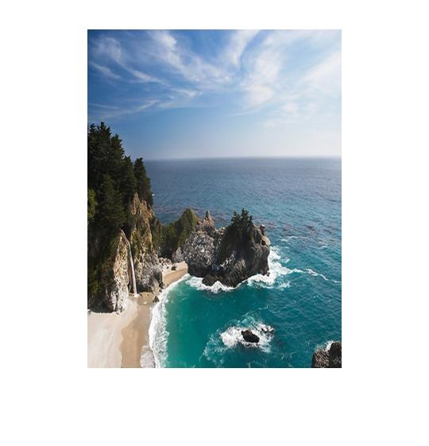
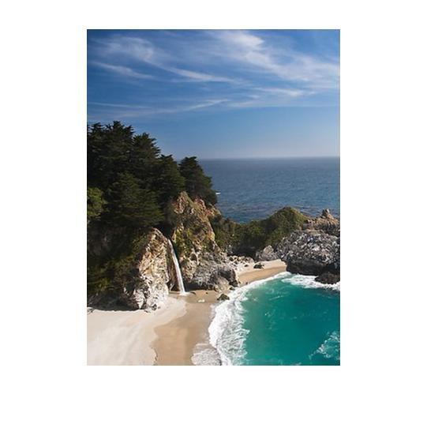
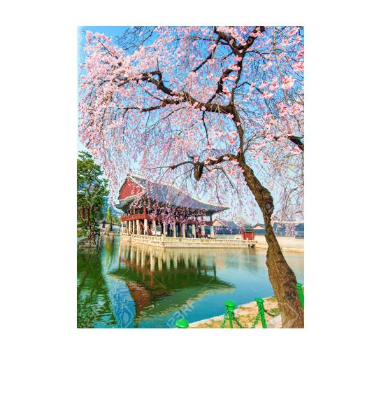
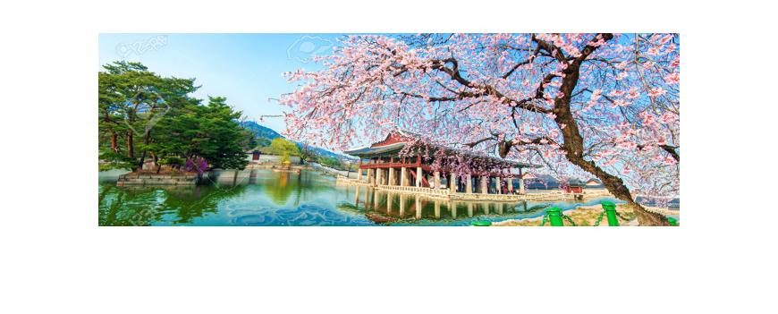
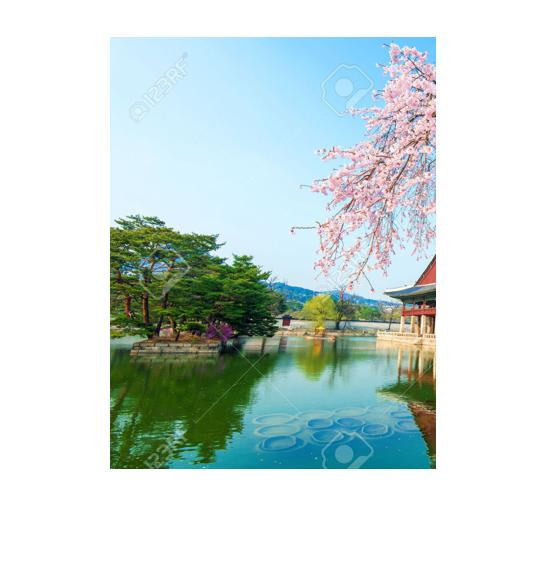

## Seam Carving for Content-Aware Image Resizing

## Overview
In this project we're going to scale/crop images using seam carving method. The main idea of this method is to delete the pixels that are not really import, so we can crop our image without losing it's integrity. First we calculate the energy value of every pixels, then 
apply the classic algorithm Dynamic Programming(DP) to find the optimal seam, and then delete the indices indicated by seam.

## Implementation
We're going to implement the following functions:
* energyRGB.m
* findOptSeam.m
* reduceImageByMask.m

### energyRGB.m -- Calculate the energy value of each pixels with energy function
By definition, we collect the gradient in each dimension of the image using imfilter(), and then sum up their absolute value in all
channels(RGB).
```
dx = [-1 0 1; -1 0 1; -1 0 1]; % horizontal gradient filter 
dy = dx'; % vertical gradient filter

Ix = abs(imfilter(I,dx));
Iy = abs(imfilter(I,dy));

res = sum(Ix+Iy,3);
```
### findOptSeam.m -- Find the best route using DP
First we construct a seam map, we assign each indices' value to the original image's energy value, and than sum up each pixels(from row 2 to the last row) with it's minimum nearby column index in the upper row using DP.
```
    for i = 2 : sz(1)
        for j = 2 : sz(2) - 1
            M(i, j) = M(i, j) + min(M(i-1,j-1:j+1));
        end
    end
```
Now find the index of minimum value in the last row, and find a route up to the first row with the minimum value, map the indices in seam map simultaneously.
```
    for i = sz(1) : -1 : 1
        if i == sz(1)
            [~,j] = min(M(i,1:end));
        else
            [~,tmp] = min(M(i,j-1:j+1));
            j = tmp + j - 2;
        end   
        optSeamMask(i,j) = 1;
    end
```
### reduceImageByMask.m -- Delete the unnecessary pixels according to the seam mask value.
Find zero in each row of seam mask,say *ind*, and then concatenate left and right part of *ind* (1~ind-1 and ind+1~end) to be a new array, and the deletion is completed. When doing horizontal task, we should transpose the image and mask first, then do the same process, and then return the transposed back reduced image
```
    sz = size(image);
    for i = 1:sz(1)
        locat = find(~seamMask(i,:));
        imageReduced(i,:,:) = [image(i,1:locat-1,:) image(i,locat+1:sz(2),:)];
    end
```

## Installation
Matlab, VPN

## Results

### Image : Sea
Original Image
 
Vertical seam carving 

Horizontal seam carving

Pure Image scaling

Pure Image cropping


### Image : Soeul
Original Image
 
Vertical seam carving 

Horizontal seam carving

Pure Image scaling

Pure Image cropping


### Image : Shanghai
Original Image
 
Vertical seam carving 

Horizontal seam carving

Pure Image scaling

Pure Image cropping


## Discussion & Conclusion
We compared both seam version of cropped image and pure cropped image, the seam version looks more meaningful, containing more details 
and informations, so we can conclude that it's a good way to crop image without losing too much information.
